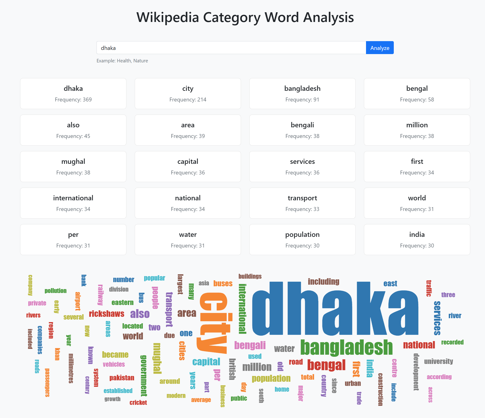

# Wikipedia Category Word Analysis

A web application that analyzes word frequencies from Wikipedia categories and visualizes the results with an interactive word cloud.



## Features

- **Category Analysis**: Enter any Wikipedia category to analyze word frequencies across all articles in that category
- **Word Cloud Visualization**: See the most frequent words displayed as an interactive word cloud
- **Responsive Design**: Works on desktop and mobile devices
- **Caching System**: Improves performance by caching previous analysis results

## Technologies Used

- **Backend**: FastAPI (Python)
- **Frontend**: HTML, CSS, JavaScript
- **Styling**: Bootstrap 5
- **Visualization**: D3.js
- **API**: MediaWiki API for Wikipedia data

## Getting Started

### Prerequisites

- Python 3.7+
- pip (Python package manager)

### Installation

1. Clone the repository
   ```bash
   git clone https://github.com/tohidul3417/wikipedia_analysis.git
   cd wikipedia_analysis
   ```

2. Install dependencies
   ```bash
   pip install -r requirements.txt
   ```

### Running the Application

There are two ways to run the application:

#### Option 1: Using Python directly
```bash
python app.py
```

#### Option 2: Using Uvicorn directly (recommended)
```bash
uvicorn app:app --reload
```

The `--reload` flag enables auto-reloading when code changes are detected, which is useful during development.

3. Once the server is running, you should see output similar to:
   ```
   INFO:     Uvicorn running on http://127.0.0.1:8000 (Press CTRL+C to quit)
   ```

4. Open your browser and navigate to `http://127.0.0.1:8000`

## Usage

1. Enter a Wikipedia category name in the search box (e.g., "Artificial_Intelligence", "Machine_Learning")
2. Click "Analyze" or press Enter
3. View the results showing the most frequent words and their occurrences
4. Explore the word cloud visualization

## Project Structure

- `app.py` - FastAPI application and main entry point
- `wiki_category_analysis.py` - Core functionality for Wikipedia data retrieval and processing
- `templates/` - HTML templates for the web interface
- `cache/` - Directory for storing cached analysis results

## Deployment

This application can be deployed to various platforms:

- **Render**: Use the included `render.yaml` configuration
- **Heroku**: Use the included `Procfile`

## Contributing

Contributions are welcome! Please feel free to submit a Pull Request.

## License

This project is licensed under the MIT License - see the LICENSE file for details.

## Acknowledgments

- Wikipedia for providing the MediaWiki API
- NLTK for natural language processing tools
- D3.js for visualization capabilities
